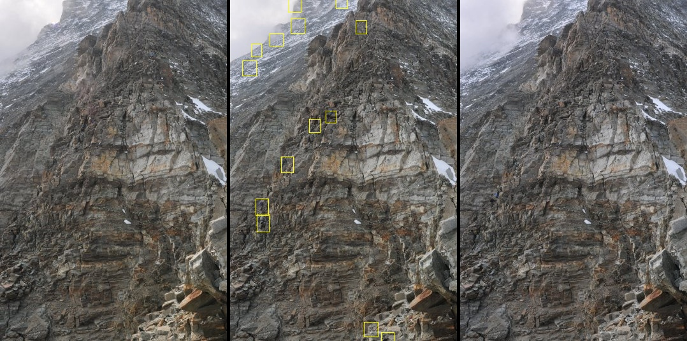

# Diff-Annotate
Data annotation tool with proposal generation and person detection support. It indicates the differences between subsequent frames with bounding boxes to identify regions of interest. Developed during [Hackathon on Permafrost](https://github.com/ETHZ-TEC/permafrostanalytics) and provided with a readme file afterwards.



## Installation

- Create a conda environment through the provided yml file.
  ```bash
  conda env create -f environment.yml
  ```
- Download the detector models ([RetinaNet](https://github.com/OlafenwaMoses/ImageAI/releases/download/1.0/resnet50_coco_best_v2.0.1.h5), [YOLOv3](https://github.com/OlafenwaMoses/ImageAI/releases/download/1.0/yolo.h5), [TinyYOLOv3](https://github.com/OlafenwaMoses/ImageAI/releases/download/1.0/yolo-tiny.h5)) to be used and place them under a folder called `models`.
- Download the [full image dataset](https://storageaccountperma8980.blob.core.windows.net/hackathon-on-permafrost/timelapse_images_fast.zip) (**6.7G!**) or rather experiment only with [images from a single day](https://n.ethz.ch/~dcetin/download/2017-09-08.zip) (**27M**). Unzip the archive and place the image folders under a directory called `data`.

## Usage

To use the tool on the provided example data simply call the script by providing the folder of interest:
```bash
python differ.py --day "2017-09-08" --saveCSV
```

Intermediate outputs for the last image can be found in `temp` folder, which might come in handy if further visual inspection is needed. To work on your own dataset place the image folder under the `data` folder and provide its name to script. Parameters of the script are finetuned on the permafrost dataset, so please change them accordingly for other datasets. Be sure to change also the `labelDict.json` to match desired label and key pairs. One important thing to keep in mind is that the **files must be named according to their temporal ordering**, i.e. if one frame immediately follows another, the name of that frame should also directly follow the other filename.
